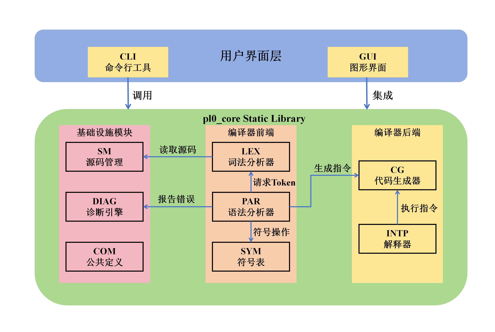

# Extended PL/0 Compiler

[](https://en.cppreference.com/w/cpp/17)
[](https://opensource.org/licenses/MIT)
[](https://cmake.org/)
[](https://www.qt.io/)

An advanced, feature-rich compiler and interpreter for the Extended PL/0 language. Built with modern C++17, this project offers a high-performance stack-based virtual machine, a sophisticated recursive descent parser with error recovery, and a powerful Qt5-based IDE for visual debugging.

[**Features**](#-features) | [**Quick Start**](#-quick-start) | [**Grammar**](#-ebnf-grammar) | [**Debugger**](#-gui-debugger) | [**Architecture**](#-architecture)

---

## Features

### Core Compiler Engine
- **Robust Lexer**: High-performance tokenization with precise source location tracking.
- **Advanced Parser**: Recursive descent parser featuring intelligent error recovery and colorful diagnostics.
- **Smart Semantic Analysis**: Hierarchical symbol table management with deep scope handling.
- **P-Code Generation**: Efficient code generation for a specialized stack-oriented virtual machine.
- **Optimizing Interpreter**: High-speed VM execution with integrated debugging hooks.
- **Experimental Optimizer**: Multi-pass optimization pipeline including Constant Folding and Dead Code Elimination.

### Language Extensions
- **Complex Data Structures**: Support for single and multi-dimensional arrays.
- **Modern Control Flow**: `if-then-else`, `while-do`, `repeat-until`, and `for-loop` (to/downto).
- **Manual Memory Management**: C-style explicit heap allocation via `new` and `delete`.
- **First-Class Procedures**: Nested procedures, recursion support, and lexical scoping.

### Developer Tools
- **Intelligent CLI**: Smart file resolution, colorful diagnostic output, and interactive REPL debugger.
- **Comprehensive Debugging**:
  - `View Tokens`: Inspect the lexer output.
  - `AST Visualizer`: Explore the program structure.
  - `P-Code Dump`: Analyze the low-level instructions.
  - `Trace Mode`: Execute code step-by-step with real-time state inspection.
- **Built-in Test Runner**: Integrated batch testing framework for regression testing.
- **Qt5 IDE**: A modern graphical environment with syntax highlighting and visualization panels.

---

## GUI Debugger

The project includes a powerful Qt5-based IDE that transforms the compilation process into a visual experience.

> [!TIP]
> Use the GUI debugger to visualize your program's execution flow, inspect the runtime stack, and watch variable changes in real-time.

- **Breakpoints**: Interactive line-number clicking to toggle execution pauses.
- **State Visualization**: Real-time display of the Symbol Table, P-Code, and AST.
- **Memory Watch**: Explore variables, array elements, and pointer targets.
- **Stack Diagram**: Graphical representation of the runtime stack and activation records.

---

## Architecture

The compiler is designed with a modular architecture following classical compiler design patterns.




---

## Quick Start

### Prerequisites
- **Compiler**: C++17 compatible (GCC 8+, Clang 7+, or MSVC 2019+)
- **Build System**: CMake 3.16+
- **GUI Dependency**: Qt5 (Core & Widgets) - *Optional*

### Build Instructions
```bash
mkdir build && cd build
cmake .. -DCMAKE_BUILD_TYPE=Release
make -j$(nproc)
```

### Basic Usage
```bash
# Compile and run a program
./pl0c examples/sample.pl0

# Run in interactive debug mode
./pl0c examples/sample.pl0 --debug

# Launch the GUI
./pl0gui
```

---

## EBNF Grammar

The Extended PL/0 language supports a rich set of constructs defined by the following EBNF:

```bnf
<prog>      ::= program <id> ";" <block>
<block>     ::= [<condecl>] [<vardecl>] [<proc>] <body>
<condecl>   ::= const <const> {"," <const>} ";"
<const>     ::= <id> ":=" <integer>
<vardecl>   ::= var <vardef> {"," <vardef>} ";"
<vardef>    ::= <id> [":" ("integer" | "pointer") | "[" <integer> "]"]
<proc>      ::= procedure <id> "(" [<id> {"," <id>}] ")" ";" <block> ";" {<proc>}
<body>      ::= begin <statement> {";" <statement>} end
<statement> ::= <id> ["[" <exp> "]"] ":=" <exp>
              | "*" <exp> ":=" <exp>
              | if <lexp> then <statement> [else <statement>]
              | while <lexp> do <statement>
              | for <id> ":=" <exp> ("to" | "downto") <exp> do <statement>
              | call <id> "(" [<exp> {"," <exp>}] ")"
              | <body>
              | read "(" <id> {"," <id>} ")"
              | write "(" <exp> {"," <exp>} ")"
              | new "(" <id> "," <exp> ")"
              | delete "(" <id> ")"
```
*(See the [full grammar documentation](doc/Grammar.md) for details on factor and expression rules.)*

---

## Documentation

For more in-depth information about the project, refer to the following documents:

- [**Grammar Specification**](doc/Grammar.md): Detailed EBNF rules for factor and expression.
- [**CLI Debug Guide**](CLI_DEBUG_GUIDE.md): Manual for the command-line interactive debugger.
- [**GUI Debug Guide**](GUI_DEBUG_GUIDE.md): Detailed usage guide for the Qt5 debugger.

---

## Testing

Comprehensive batch testing is built into the CLI:

```bash
# Run all tests in the default directory
./pl0c --test

# Run tests in a specific category
./pl0c --test test/correct
```

---

## License

This project is licensed under the **MIT License**.
Copyright (c) 2025.

